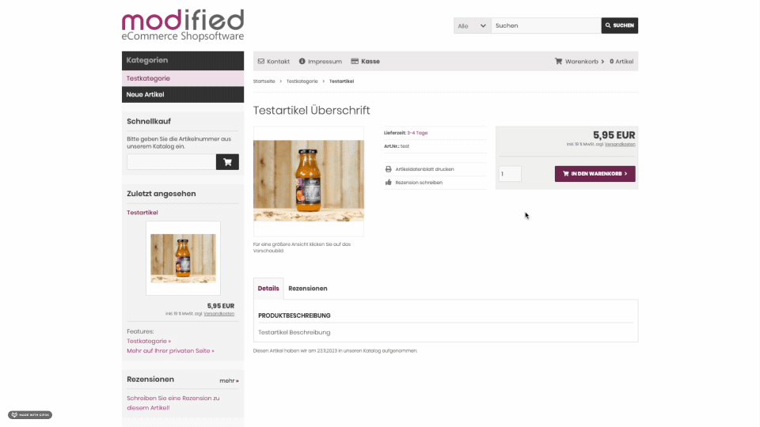

# Module: Stripe payment module for modified shop
(DE): Modul: Stripe Zahnungsmodul für den modified shop

[](https://discord.gg/9NqwJqP)

🛠 This module is under development and not ready for use. You can make a contribution if you like.




## Installation
You can install this module with the [Modified Module Loader Client (MMLC)](http://module-loader.de).

Search for: `robinthehood/stripe`

## Requirements
- PHP 8.0 or above
- modified 2.0.6.0 or above
- MMLC 1.21.0 or above

## Contributors
- Robin Wieschendorf | <mail@robinwieschendorf.de> | [robinwieschendorf.de](https://robinwieschendorf.de)
- [grandeljay](https://github.com/grandeljay)

## Contributing
We would be happy if you would like to take part in the development of this module. If you wish more features or you want to make improvements or to fix errors feel free to contribute. In order to contribute, you just have to fork this repository and make pull requests. If you don't know how to start, we are happy to help you on our [discord server](https://discord.gg/9NqwJqP).

### How to start

We are thrilled that you are considering contributing to our project. As new developers, we understand how important it is to feel supported and motivated when diving into a new codebase. That's why we strive to provide clear documentation within our code, explaining the reasoning behind our implementation choices. We believe this will greatly assist you in navigating the code more effectively.

In case you encounter any challenges while coding a modified Module, we've got you covered. We have prepared comprehensive documentation specifically tailored for developers like yourself. Take a look at our [modified developer documentation](https://docs.module-loader.de) for further guidance and insights.

We also encourage you to join our [Discord community](https://discord.gg/9NqwJqP), where you can freely discuss your ideas with us. There is usually someone online and ready to assist. Don't hesitate to reach out to us there; we are here to support you throughout your journey.

Here are a few ways you can get involved:

- **Opening an Issue on GitHub:** If you come across a bug, have a suggestion, or need clarification, feel free to open an issue on our [GitHub repository](https://github.com/RobinTheHood/modified-stripe/issues). We value your feedback and will address it promptly.

- **Choosing an Issue to Work On:** If you're eager to contribute and have a particular task in mind, let us know by commenting on the respective issue or mentioning it on Discord. This way, we can coordinate efforts and avoid duplication of work. We're excited to collaborate with you!

- **Submitting a Pull Request:** If you have already completed a piece of code or implemented a feature, we encourage you to submit a Pull Request. Your contribution will be carefully reviewed, and we greatly appreciate your effort to enhance the project.

As part of our project, we utilize Stripe Checkout, which benefits from Stripe's exceptional documentation. To get started with the Stripe module, we recommend visiting the [Stripe Checkout Quickstart](https://stripe.com/docs/checkout/quickstart) guide. It provides clear explanations and instructions on how to integrate Stripe into our project effectively.

To test the Stripe module, you can create a free Stripe account. This account operates in the sandbox (developer) mode, allowing you to experiment without any real transactions. Once you set up your account, Stripe will provide you with a public and private key specifically for testing purposes.

We look forward to your contributions and are excited to have you on board! Happy coding!

### Coding Style
We are using:
- [PSR-1: Basic Coding Standard](https://www.php-fig.org/psr/psr-1/)
- [PSR-12: Extended Coding Style](https://www.php-fig.org/psr/psr-12/) with little changes. You can use only PSR-12 or see our ruleset.xml.

### Version and Commit-Messages
We are using:
- [Semantic Versioning 2.0.0](https://semver.org)
- [Conventional Commits](https://www.conventionalcommits.org/en/v1.0.0/)

### Development Setup for Stripe and Modified Module Loader Client (MMLC)

To set up your development environment for Stripe and Modified Module Loader Client (MMLC), follow these steps:

1. Install MMLC in your shop. You can download it from [module-loader.de](https://module-loader.de).

1. *(Optional)* Configure MMLC in link mode. Refer to the [MMLC documentation](https://module-loader.de/docs/config_config.php#installMode) for instructions on enabling link mode.

1. Create the following folder structure within your shop's root directory: `SHOP-ROOT/ModifiedModuleLoaderClient/Modules/robinthehood/`

1. Load the Stripe module into the MMLC folder: `SHOP-ROOT/ModifiedModuleLoaderClient/Modules/robinthehood/stripe`. You can either clone the module using git or manually copy it into the specified location.

1. Open your shop's MMLC in your browser and search for the Stripe module. Install it through the MMLC browser interface.

1. The MMLC automatically loads any additional MMLC modules required by the Stripe module.

1. The MMLC links or copies the files from `.../Modules/robinthehood/stripe/src/...` to `SHOP-ROOT/...`.

1. The MMLC also links or copies the files from `.../Modules/robinthehood/stripe/src-mmlc/...` to `SHOP-ROOT/vendor-mmlc/robinthehood/stripe/...`.

**NOTE:** Whenever you create or delete a new file within the module, you must accept the changes in the MMLC browser interface. This ensures that the file is correctly linked or copied to your shop.

By following these steps, you will have a fully set up development environment for working with the Stripe module and the Modified Module Loader Client (MMLC).

If you have any further questions or need additional assistance, feel free to ask. Happy coding!

### Tooling Tips

In order to test the integration of Stripe on your local development machine, you need to redirect the requests that Stripe sends to your website to your local computer. You can achieve this with the following command. Please note that you must log in to Stripe using the 'stripe login' command every 90 days before proceeding.

```bash
stripe login
stripe listen --forward-to https://mmlc.ddev.site:443/rth_stripe.php\?action\=receiveHook
```

Since you can't view the PHP error messages generated by your system in the browser when Stripe sends a request to your computer, it's helpful to monitor the logs from 'modified' to ensure you always have the latest entries displayed. The following command can be useful for this purpose:

```bash
tail -f ../log/mod_error_2023-06-06.log -f ../log/mod_error_admin_2023-06-06.log
```

### How the Stripe Module Works

The Stripe module is a payment module designed for modified shops, accessible through *Admin > Modules > Payment Modules*. It is implemented as the `payment_rth_stripe` class, located in `src/includes/modules/payment/payment_rth_stripe.php`.

1. During the checkout process, the `selection()` method of the `payment_rth_stripe` class ensures that Stripe is displayed as a payment option for the buyer.

1. In the order process step `checkout_confirmation.php`, the `public $form_action_url = '/rth_stripe.php?action=checkout'` attribute of the `payment_rth_stripe` class directs the flow to our entry point file `rth_stripe.php`, instead of the default `checkout_process.php > checkout_success.php`.

1. Within `rth_stripe.php`, we first instantiate a controller, `src-mmlc/Classes/Controller.php`. The controller's `invokeCheckout()` method is automatically called since the URL contains `.../rth_stripe.php?action=checkout`. The controller determines the appropriate method to execute based on the provided action query parameter.

1. In the `invokeCheckout()` method, we create a Stripe checkout session using the Stripe library (added to the project via Composer) and redirect the buyer to the Stripe platform. When setting up the Stripe session, we can transmit the shopping cart's value to Stripe and specify the success and failure pages to which Stripe should redirect.

1. The buyer proceeds to make their payment on the Stripe checkout page. Subsequently, Stripe redirects us back to either `.../rth_stripe.php?action=success` or `.../rth_stripe.php?action=cancel`.

1. In the controller's `invokeSuccess()` method, we can forward to `checkout_process.php > checkout_success.php`, allowing the shop to create the order accordingly. The `invokeCancel()` method handles cases where the payment was unsuccessful, enabling us to inform the buyer about the issue.


## Support and Questions
You can ask your questions on our [discord server](https://discord.gg/9NqwJqP).

## Good to know

### Apple Pay

Apple Pay is only displayed in the Safari browser and only if you have configured a card in your wallet on your device (iPhone). If no card is configured, the Apple Pay button will not work

For Apple Pay you have to Setup your Domain at and add a file at Settings > Payment Methods > Payment Methods Domains: `/.well-known/apple-developer-merchantid-domain-association`

Maybe you have to configure your .htacces:

```htaccess
RewriteRule ^/.well-known/apple-developer-merchantid-domain-association .well-known/apple-developer-merchantid-domain-association [QSA,L]
``````